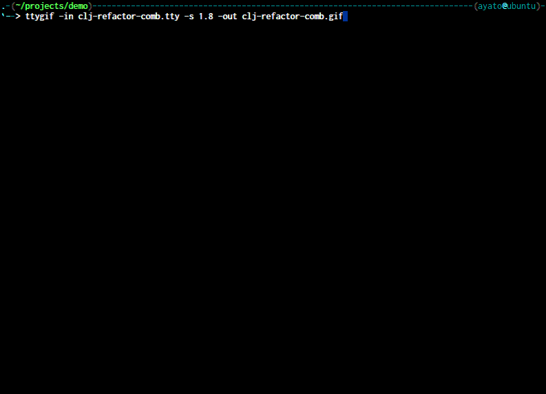

===================================
 Emacs config for newbie clojurian
===================================

.. sourcecode:: shell

  git clone git@github.com:ayato-p/emacs-config-for-newbie-clojurian.git .emacs.d

.. sourcecode:: clojure

  ;; ~/.lein/profiles.clj
  {:repl {:plugins [[cider/cider-nrepl "0.9.1"]
                    [refactor-nrepl "1.1.0"]]
          :dependencies [[org.clojure/tools.nrepl "0.2.12"]]}}

